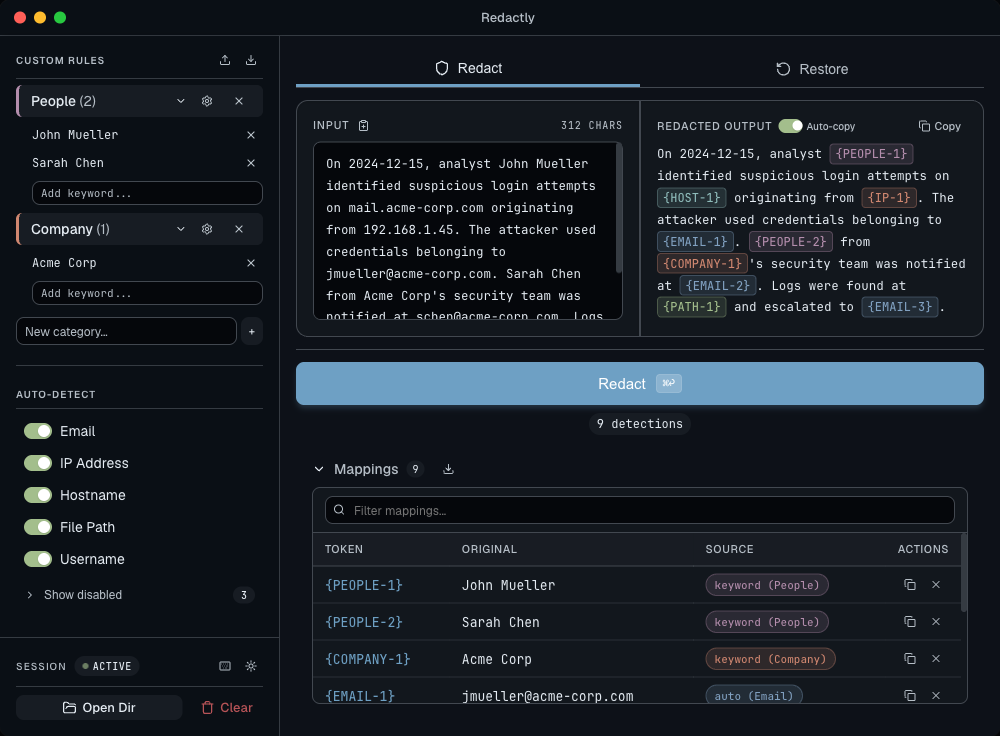
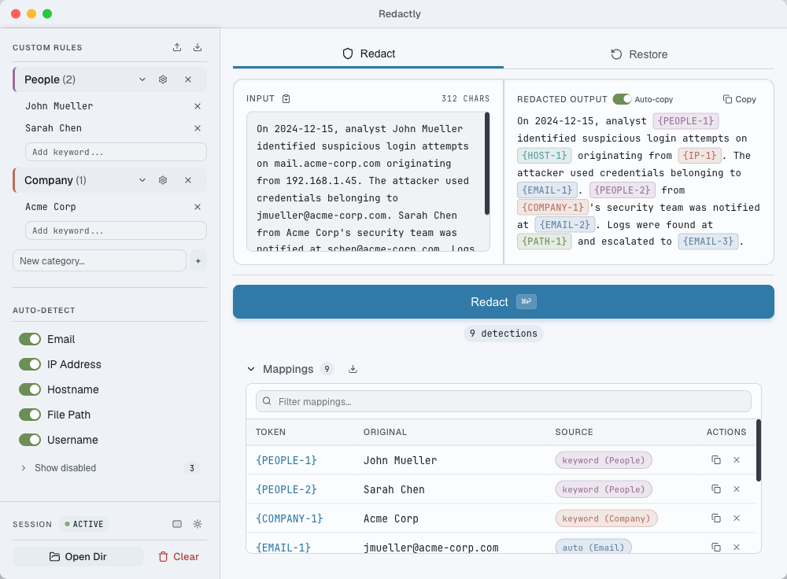
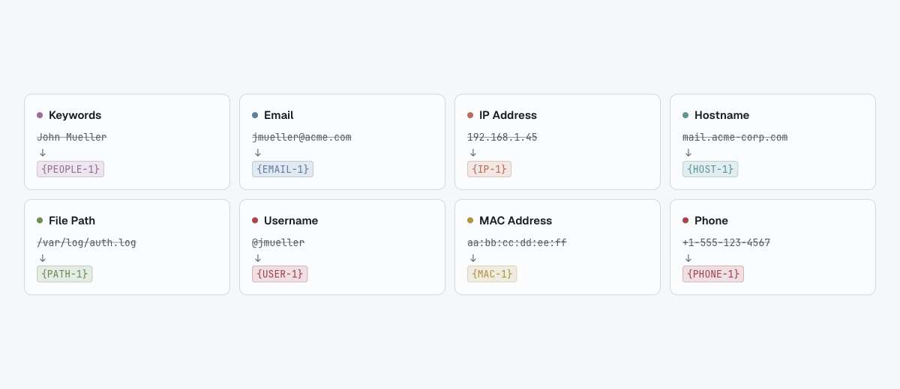
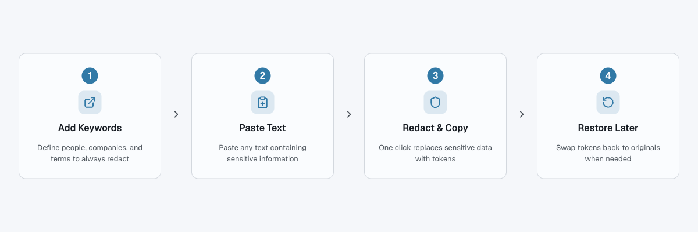

<h1 align="center">Redactly</h1>

<p align="center">
  Redact sensitive text before sharing with AI, then restore it when you're done.
</p>

<p align="center">
  
  
  
</p>

> **Note:** Redactly is a tool for masking text before sharing. It is not a security product and makes no guarantees about data protection. Use your own judgement when handling sensitive information.

<br />

<p align="center">
  
</p>

<details>
<summary>Light mode</summary>
<p align="center">
  
</p>
</details>

## Features

- **Keyword-first matching** - Define custom keywords that always get redacted, with priority over auto-detect patterns
- **Auto-detect patterns** - Automatically catches emails, IP addresses, hostnames, file paths, and usernames
- **Fuzzy matching** - Finds keyword variants and near-matches so sensitive terms don't slip through
- **One-click restore** - Reverse redacted tokens back to the original text using stored mappings
- **Session persistence** - Mappings are saved to a `.redact-map.json` file so you can restore across sessions

<p align="center">
  <picture>
    <source media="(prefers-color-scheme: light)" srcset="docs/images/08-detection-types-light.png" />
    <source media="(prefers-color-scheme: dark)" srcset="docs/images/08-detection-types.png" />
    
  </picture>
</p>

## How It Works

<p align="center">
  <picture>
    <source media="(prefers-color-scheme: light)" srcset="docs/images/07-how-it-works-flow-light.png" />
    <source media="(prefers-color-scheme: dark)" srcset="docs/images/07-how-it-works-flow.png" />
    
  </picture>
</p>

1. **Add keywords** - Enter names, project codes, or any terms you want redacted
2. **Paste your text** - Drop in the content you plan to share (logs, documents, chat messages)
3. **Copy & share** - Redactly replaces sensitive values with consistent tokens like `[KEYWORD-1]` or `[EMAIL-1]`
4. **Restore later** - Paste the redacted text back in to reverse all tokens to their original values

## Installation

### Download

Grab the latest `.dmg` from [Releases](https://github.com/cowboyvang/redactly/releases), mount it, and drag Redactly to your Applications folder.

### Build from Source

Requires [Rust](https://rustup.rs/), [Node.js](https://nodejs.org/) (v18+), and the [Tauri v2 prerequisites](https://v2.tauri.app/start/prerequisites/).

```bash
git clone https://github.com/cowboyvang/redactly.git
cd redactly
npm install
npm run tauri build
```

The built `.dmg` will be in `src-tauri/target/release/bundle/dmg/`.

<details>
<summary><strong>Development</strong></summary>

### Dev Commands

```bash
npm run tauri dev           # Start dev server + Tauri window
npm run tauri build         # Production build (.dmg/.app)
cd src-tauri && cargo test  # Run Rust tests
npx tsc --noEmit            # Type-check frontend
```

### Architecture

Rust handles all redaction logic. React is a thin display layer that calls into the backend via Tauri's `invoke()` bridge.

```
src/                    # React frontend (React 19, TypeScript, Tailwind CSS v4)
  components/           # Sidebar, RedactPanel, RestorePanel, MappingTable
  hooks/                # useRedact, useKeywords

src-tauri/src/          # Rust backend
  engine/               # Core redaction engine
    pipeline.rs         # Orchestrates keyword → pattern → token → restore
    keyword.rs          # Exact, case-insensitive, variant, and fuzzy matching
    pattern.rs          # Regex-based detection (email, IP, hostname, path, username)
    types.rs            # Shared types (Detection, RedactionMapping)
  session/              # Session management and .redact-map.json persistence
  keywords/             # Keyword store (keywords.json)
  commands.rs           # Tauri command handlers
```

### Tech Stack

| Layer | Technology |
|-------|------------|
| Backend | Rust, Tauri v2, regex, strsim, serde, chrono |
| Frontend | React 19, TypeScript, Vite, Tailwind CSS v4 |
| UI | shadcn/ui components, Nord-inspired dark theme |

</details>

## Contributing

Contributions are welcome. Please open an issue to discuss larger changes before submitting a PR.

## Acknowledgements

- [Tauri](https://tauri.app) - Desktop app framework
- [Nord](https://www.nordtheme.com) - Color palette inspiration
- [shadcn/ui](https://ui.shadcn.com) - Component design patterns
- [Radix UI](https://www.radix-ui.com) - Headless component primitives
- [Lucide](https://lucide.dev) - Icon library
- [Geist](https://vercel.com/font) - UI typeface by Vercel
- [JetBrains Mono](https://www.jetbrains.com/lp/mono/) - Monospace typeface
- [Tailwind CSS](https://tailwindcss.com) - Utility-first CSS
- [Vite](https://vite.dev) - Frontend build tool

## License

[MIT](LICENSE)
